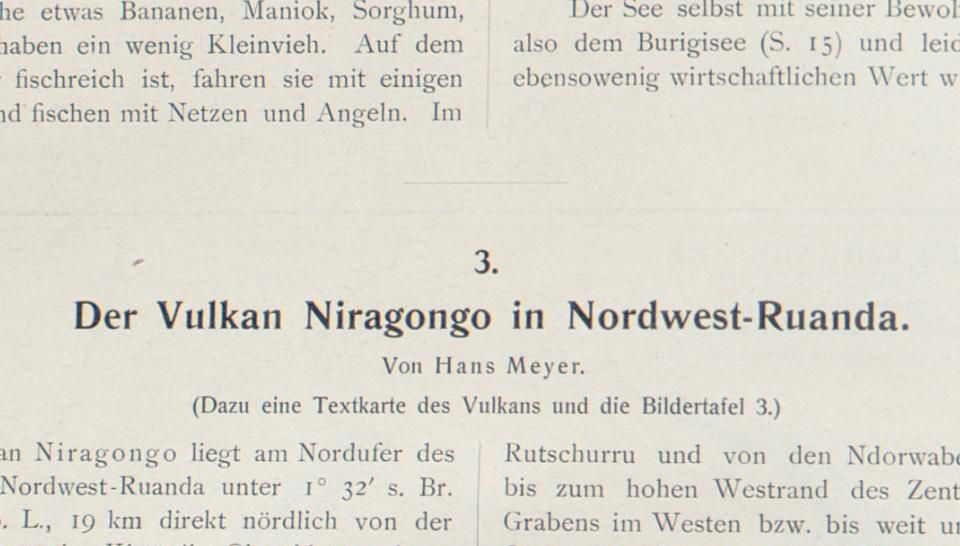
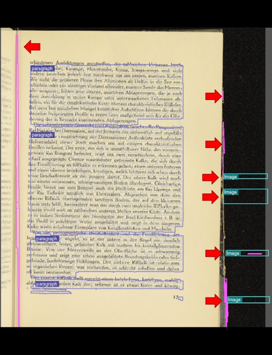
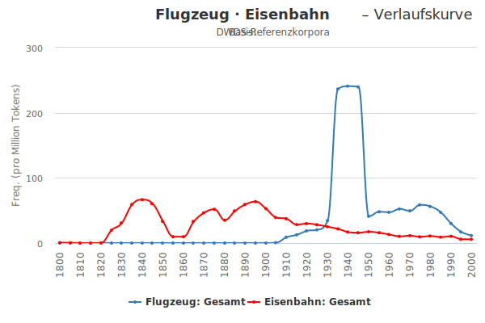
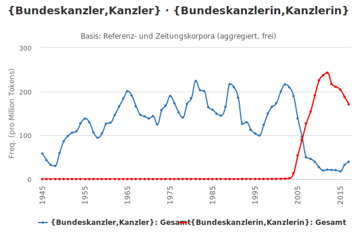

layout: true
  
<div class="my-header"></div>

<div class="my-footer">
  <table>
    <tr>
      <td>Digitale Sammlung Deutscher Kolonialismus</td>
      <td style="text-align:right"><a href="http://www.bbaw.de/forschung/digitale-sammlung-deutscher-kolonialismus/uebersicht">www.bbaw.de</a></td>
    </tr>
  </table>
</div>

---

class: title-slide

# tocrify

## Verfeinerung der Strukturierung von OCR-Volltexten durch Integration manuell erfasster Strukturelemente

| Matthias Boenig | Kay-Michael Würzner |
|:----------------:|:----------------:|:-------------------:|
| [boenig@bbaw.de](mailto:boenig@bbaw.de) | [wuerzner@bbaw.de](mailto:wuerzner@bbaw.de) |

---

# Inhalte

1. Konvertierungworkflow
  - `tocrify`: Werkzeug zur Anreicherung der OCR-Ergebnisse
  - `hocr2tei`: XSLT-Stylesheets zur Konvertierung der angereicherten OCR nach DTABf
2. DSDK-Korpus
  - aktueller Stand der Konvertierung
  - Anwendungsbeispiele der Korpusinfrastruktur des Zentrums Sprache auf die DSDK-Daten
3. Diskussion
  - nächste Schritte und ToDos
  - Optimierungsmöglichkeiten im Workflow
  - Perspektiven für die Volltextdigitalisierung in wissenschaftlichen Bibliotheken

---

class: title-slide

# Konvertierung

---

# Konvertierung - Motivation

- (proto-)typische Ausgangslage:
    + METS-XML mit (MODS-)Metadaten sowie manuellen Strukturauszeichnungen (häufig einfach „abgeschriebene“ Inhaltsverzeichnisse)
    + Bilddateien (verzeichnet im METS)
    + OCR-Dateien (auf Seitenebene verknüpft mit den Bildern)
- Ziel:
    + **adäquate** Repräsentation der Volltexte in TEI
        * *Best practice* für Textdaten in den digitalen Geisteswissenschaften
        * dokumentbezogenes Format
        * **DTA-Basisformat** (DTABf) als de-facto Standard für historische Textdaten
    + Anschluss an bestehende Forschungsinfrastrukturen

---

# Konvertierung - Baseline

- triviales Vorgehen:
  ```xml
  <tei>
    <teiHeader><!-- Informationen aus MODS --></teiHeader>
    <text>
      <body>
        <p>
          <!-- OCR-Volltext -->
        </p>
      </body>
    </text>
  </tei>
  ```
- valide aber nicht **adäquat**

---

# Konvertierung - Idee

- Nachnutzung der manuell gesammelten Strukturdaten (`<mets:structMap TYPE="LOGICAL" />`)
  ```xml
  <mets:div ID="log9156964"
            TYPE="chapter"
            LABEL="Geologische Uebersicht"
            ORDER="7"/>
  ```
- Auszeichnung der entsprechenden Volltextpassagen in der OCR
- Übernahme nach DTABf
  + Seiten- → Dokumentebene
  + *umspannende* `div`-Struktur

---

# Konvertierung - Herausforderungen

- Verknüpfung zwischen Struktur und Text auf Seitenebene (keine Lokalisierung im Text)
  + Lösungsansatz: Lokalisierung des Strukturelements auf der Seite über Textvergleich
- mangelndes Strukturauszeichnungsinventar in ABBYY-FineReader-XML
  + Lösungsansatz: Konvertierung in feingranulareres OCR-Format
- nicht standardgemäße Seitenverknüpfung in `<mets:structLink/>` durch *anonyme* IDs
  + Lösungsansatz: Auflösung der anonymen IDs
- nicht erfasste Vakatseiten und Abbildungen
  + Lösungsansatz: Ergänzung leerer ABBYY-FineReader-XML-Dateien
  
---

# Konvertierung - Workflow

1. **Konvertierung** ABBYY-FineReader-XML nach hOCR
  - mit Hilfe eines XSLT-Stylesheets (https://github.com/OCR-D/format-converters)
2. **Anreicherung** der hOCR-Dateien mit Strukturelementen
  - Python-Skript `tocrify` (https://github.com/deutschestextarchiv/tocrify)
3. **Aggregation** der Seiten- zur Dokumentebene
  - Anpassung der hOCR-Tool-Suite (https://github.com/tmbdev/hocr-tools)
4. **Konvertierung** von hOCR nach DTABf
  - mit Hilfe eines XSLT-Stylesheets (https://github.com/OCR-D/format-converters)
  - Integration der MODS-Metadaten in den TEI-Header
5. **Integration** in die Korpusinfrastruktur des Zentrums Sprache sowie in DTAQ

---

# Konvertierung - tocrify

- Ziel: *Lokalisierung* des Strukturelements auf der Seite (Ermittlung der Koordinaten)
- Rezept:
  + Vergleich des zu lokalisierenden Textes `\(t\)` mit allen Positionen `\(i\)` in der OCR `\(O=o_1\ldots o_n\)`
  + minimaler Editierabstand zwischen `\(t\)` und `\(o_i\ldots o_{i+|t|}\)` als Platzierungskriterium
  + Inklusion aller Zeilen, die Teile der optimalen OCR-Sequenz enthalten
- Auszeichnung der ermittelten Zeilen als `TYPE` (i.e. Strukturtyp nach METS)

---

# Konvertierung - tocrify-Beispiel


  
```xml
  <div TYPE="section"
       LABEL="3. Der Vulkan Niragongo in Nordwest-Ruanda" />
```
```xml
  <text>
    <par>
      <line>
        <charParams>2</charParams>
      </line>
      <line>
        <charParams>D</charParams>
        …
```

---

# Konvertierung - Probleme

1. Textvergleich
    + stillschweigende Normalisierung (ſ → s, th → t etc.)
    + Übernahme des Inhaltsverzeichnisses
        * zusätzliche Nummerierung
        * Groß-/Kleinschreibung
    + suboptimale Textqualität durch Einsatz veralteter FineReader-Version (i.e. „präimpact“)
2. fehlende Label
    + 35 von 256 Büchern mit Kapiteltitel *Text*
3. fehlerhafte Layouterkennung
    + Überschriften in verschiedene Absätze unterteilt: gelöst
    + Überschriften auf verschiedene Absätze verteilt: noch nicht gelöst
4. fehlendes Cropping

---

# Konvertierung - Cropping

.center[]

---

class: title-slide

# DSDK-Korpus

---

# DSDK-Korpus - aktueller Stand

- 256 Bücher konvertiert und indiziert
  + Teile der Frankfurter Lieferung
  + komplett Antiqua
  + 13.397.229 Tokens
- Zugriff über http://www.deutschestextarchiv.de/dtaq
  + Einzelwerkebene
  + Text-/Bildansicht
  + Ticketsystem
- Zugriff über http://kaskade.dwds.de/dstar
  + Korpusebene
  + Suche und KWIC-Ansicht
  + Frequenzverläufe
  + Kollokationsanalyse

---

# DSDK-Korpus - Analyse

- Analysekette:
    + Zerlegung des Fließtextes in Wörter und Sätze: **Tokenisierung**
    + Bestimmung der Grundform der Wörter: **Lemmatisierung**
    + Bestimmung der tatsächlichen Wortart eines Wortes: **PoS-Tagging**
    + Normalisierung historischer Schreibvarianten: **Kanonisierung**
    + Auszählen gemeinsamer Vorkommen von Wörtern bzw. Wortgruppen: **distributionelle Semantik**
- vollautomatisch möglich (mit akzeptabler Qualität)
- zwei grundsätzliche Ansätze der Modellierung:
    + auf Basis von Expertenwissen **manuell** erstellte Regeln
    + auf Basis manuell erstellter Beispiele **automatisch** induzierte Regeln

---

# DSDK-Korpus - Suche

- Indizierung der Text- und Metadaten
    + Wortattribute
        * Token, Lemma, PoS, kanonische Schreibung ...
    + Metadatenattribute
        * Autor, Titel, Datum, Textsorte ...
- Abfragetypen
    + einfache Suche: [`Tat`](http://kaskade.dwds.de/dstar/dsdk/dstar.perl?q=Tat&fmt=kwic&start=1&limit=10&ctx=8&debug=)
    + Term-Expansion: [Query Lizard: `Tat`](http://kaskade.dwds.de/dtaos/lizard.perl?q=Tat)
    + Konjunktion, satzlokal: [`Bank {Geld, Kredit}`](http://kaskade.dwds.de/dstar/dsdk/dstar.perl?fmt=kwic&corpus=&limit=50&ctx=&q=Bank+%7BGeld%2CKredit%7D+%23in+s+%23asc_date&_s=submit)
    + oder termlokal: [`das with $p=PDS`](http://kaskade.dwds.de/dstar/dsdk/dstar.perl?fmt=kwic&corpus=&limit=50&ctx=&q=das+with+%24p%3DPDS&_s=submit)
    + Wildcards, Phrasen, RegEx: [`"anti* #2 Propaganda"`](http://kaskade.dwds.de/dstar/dsdk/dstar.perl?q=%22anti%2A+%232+Propaganda%22+%23left%5B0%5D&fmt=kwic&ctx=6)

---

# DSDK-Korpus - Wortverlaufskurven

- **Häufigkeit eines Wort über einen zeitlichen Verlauf**
- nutzen Textsammlungen als Basis
    + nur sinnvoll bei entsprechender zeitlicher Stratifizierung
- Metadaten für jeden Text:
    + *Datum* (Jahr)
    + *Textklasse* (Belletristik, Gebrauchsliteratur, Wissenschaft, Zeitung)
    + und viele weitere (i.e. beliebige Suchabfragen)
- Darstellung:
    + relativ (Vorkommen pro Million)
        * 
.red[Achtung!] Kurven werden häufig geglättet, da nicht für jedes Jahr ausreichend und gleich viele Daten verfügbar sind
    + in absoluten Zahlen

---

# DSDK-Korpus - Beispiele

- [Tokenbestand](http://kaskade.dwds.de/dstar/dsdk/hist.perl?fmt=hist&pformat=svg&q=*&_s=submit&n=abs&smooth=none&sl=1&w=0&wb=0&pr=0&xr=*%3A*&yr=0%3A*&psize=840%2C480)

---

# DWDS - Wortverlaufskurven

.center[]

---

# DWDS - Wortverlaufskurven

.center[]

---

# DSDK-Korpus - Diacollo

- *Kollokation*: häufiges gemeinsames Auftreten zweier Wörter in vordefiniertem Kontext (Satz, Absatz etc.)
  + enge semantische Beziehungen (*Schüler* → *Lehrer*) 
  + Sachverhalte (*Schule* → *Reform*) 
  + feste Phrasen (*Hänschen* → *Hans*)
- **Grundidee:**
  + Ermittlung aller Kollokationen eines Eingabebegriffes
  + Ordnung nach deren Assoziationsgrad zum Eingabebegriff
  + Beispiel [*Begriff*](http://kaskade.dwds.de/dstar/dta/diacollo/?query=Begriff&date=&slice=50&score=ld&kbest=20&cutoff=&profile=2&format=cloud&groupby=&eps=0) im DTA

---

# DSDK-Korpus - Diacollo

> *„Die Bedeutung eines Wortes ist sein Gebrauch in der Sprache.“*<br />
> Ludwig Wittgenstein (Philosophische Untersuchungen)

- DiaCollo: diachrone Kollokationsanalyse 
  + Untersuchungszeiträume frei skalierbar (jahresweise, dekadenweise etc.)
  + Visualisierungsoptionen für Abfrageergebnisse (Wordclouds, Bubble, Gmotion, HTML‐Listen)
  + prinzipiell eine Kombination von Wortverlaufskurven und distributioneller Semantik
- getestet an großen und mittelgroßen Korpora, darunter *Die Grenzboten* und *DDR-Presseportal*

---

# DSDK-Korpus - Beispiele

- [Malaria](http://kaskade.dwds.de/dstar/dsdk/diacollo/?query=Malaria&_s=submit&date=1870%3A*&slice=5&score=ld&kbest=30&cutoff=&profile=2&format=cloud&global=1&groupby=&eps=0)
  + Chinin als Mittel gegen Malaria bekannt seit dem 17. Jh.
  + gewonnen aus der Rinde des Chinarindenbaums (endemisch in Südamerika)
  + erhöhter Bedarf durch Kolonisation
- [Kunst](http://kaskade.dwds.de/dstar/dsdk/diacollo/?query=Kunst&date=1870%3A*&slice=5&score=ld&kbest=30&cutoff=&profile=2&format=cloud&global=1&groupby=&eps=0)
  + Anfang des 20. Jahrhunderts verstärkte Auseinandersetzung mit der afrikanischen, eingeborenen Kunst
  + insbesondere durch den aufkommenden Expressionismus, in Deutschland speziell durch die Künstlervereinigung *Brücke*
- [Kunst vs. Kultur](http://kaskade.dwds.de/dstar/dsdk/diacollo/?query=Kunst&_s=submit&bquery=Kultur&date=&slice=10&bdate=&bslice=10&score=ld&kbest=10&diff=adiff&profile=diff-2&format=html&groupby=l%2Cp%3DNN&eps=0)
  + Unterschiede und Gemeinsamkeiten zwischen Begriffen sichtbar machen


---

class: title-slide

# Diskussion

---

# Diskussion

- DSDK: einzigartige Quelle für die historische, sprachwissenschaftliche und soziologische Forschung
- vergleichende Beforschung durch Integration in CLARIN-D-Korpusinfrastruktur möglich
    + Grenzboten
    + Deutsches Textarchiv
    + ...
- relativ hohe Einstiegshürde bei der Arbeit mit quantitativen Auswertungen
    + methodische Grundlagen
    + technische Details
      * Abfragesprache
      * Parameterauswahl

---

# Diskussion

- mehr Quellen, bessere Forschung?
- Text- und insbesondere Strukturerkennungsqualität **ausbaufähig**
- Übertrag des Standes der Forschung im Bereich OCR in die bibliothekarische Praxis!
    + ABBYY FineReader seit Impact in den kritischen Bereichen unverändert
    + Projekte wie READ, Kallimachos oder OCR-D aufwendig gefördert
    + in den Bibliotheken jedoch außer im Projektkontext kaum Veränderung
    + Google ist keine Lösung!
- **einfache Modifikationen** mit enormer Wirkung
    + Cropping!
    + Text-/Bildverknüpfung auf Koordinatenebene

---

# Diskussion

- Wer kann die Konsolidierung und *Produktivierung* von Forschungsergebnissen perspektivisch übernehmen?
- Wer kümmert sich um *Pflege und Weiterentwicklung* von Texterkennungssoftware?
- Wie kann eine *kontinuierliche Optimierung* der Text- und Strukturdaten in den Bibliotheken realisiert werden?
- Wie können Forschungsinfrastrukturen wie CLARIN-D auch nach *Ende ihrer Förderung* weiterbestehen?

---

class: title-slide

# Danke für Ihre Aufmerksamkeit
